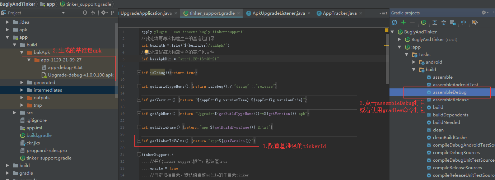
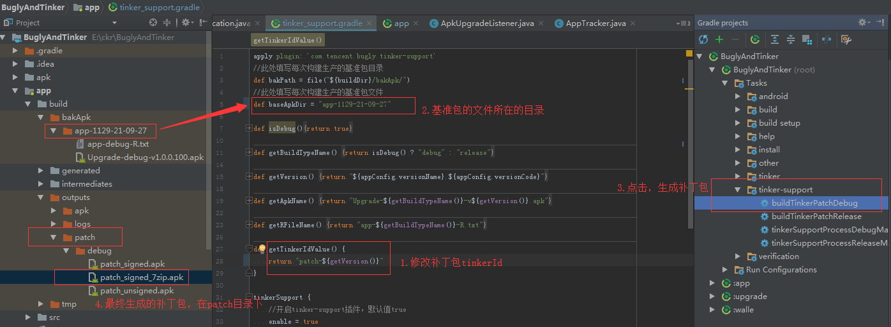
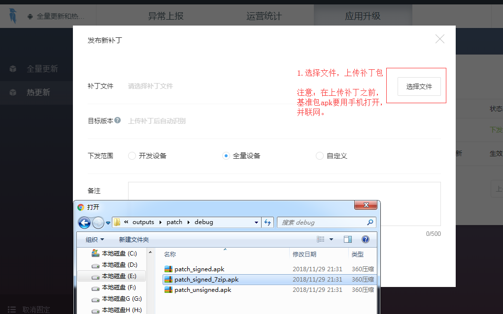

# BuglyAndTinker
App全量更新和热更新

## Demo
[下载apk](apk/Upgrade-debug-v1.0.0.100.apk)

## 依赖
### 添加依赖：
```
  dependencies {
    implementation 'ckrjfrog.Upgrade:AppUpgrade:1.0.3'
  }
```

## 功能及使用
### 1.升级功能
* 升级功能集成：
```
  android {
    ndk {
      //设置支持的SO库
      abiFilters "armeabi","armeabi-v7a","arm64-v8a","mips","mips64","x86","x86_64"
    }
  }
  
  dependencies {
    implementation 'com.tencent.bugly:crashreport_upgrade:latest.release'
    implementation 'com.tencent.bugly:nativecrashreport:latest.release'
  }
```
* 代码使用

步骤一.bugly初始化：UpgradeManager.init()
```
  UpgradeConfig.isDebug = BuildConfig.IS_DEBUG;
  UpgradeConfig.isAutoInstall = true;
  UpgradeConfig.enableNotification = true;
  UpgradeConfig.enableWriteChannelInfo = true;
  UpgradeConfig.canShowUpgradeActs.add(MainActivity.class);
  UpgradeConfig upgradeConfig = new UpgradeConfig(BUGLY_ID, BuildConfig.VERSION_NAME, ChannelUtil.getChannelInfo(this.getApplication().getApplicationContext()), R.mipmap.ic_launcher);
  //升级功能配置
  UpgradeManager.init(getApplication(), upgradeConfig);
```
步骤二.apk下载
```
  DownloadManager.with(context).setUpgradeInfo(info);//设置升级信息,注意：设置升级信息一定要在调用下载apk之前
  DownloadManager.with(context).startDownload();//下载apk
```
* 属性说明  

|属性|描述|类型|默认值|
|---|---|---|---|
|smallIconId|通知栏小图标资源id|int|-1|
|isAutoInstall|是否自动安装|boolean|true|
|enableNotification|是否发送通知|boolean|true|
|enableWriteChannelInfo|是否写入渠道|boolean|true|
|canShowUpgradeActs|可以显示升级框的场景|List<Class<? extends Activity>>|无|

* 升级信息

|属性|描述|类型|默认值|
|---|---|---|---|
|title|升级标题|String|null|
|newFeature|升级说明|String|null|
|publishTime|发布时间|long|0|
|publishType|发布类型|int|0:测试，1:正式|
|upgradeType|升级类型|int|1:建议，2:强制|
|popTimes|升级提醒次数|int|0|
|popInterval|升级提醒间隔|int|0|
|versionCode|版本号|int|0|
|versionName|版本名|String|null|
|apkUrl|apk下载链接|String|null|
|fileSize|apk文件大小|long|0|

### 2.热更新功能
* tinker热更新集成：
```
  apply from: 'tinker_support.gradle'
  dependencies {
    //gradle 3.0以上
    implementation 'com.tencent.tinker:tinker-android-lib:1.1.5'
    annotationProcessor 'com.tencent.tinker:tinker-android-anno:1.1.5'
    compileOnly 'com.tencent.tinker:tinker-android-anno:1.1.5'
    
    //gradle 3.0一下
    //compile 'com.tencent.tinker:tinker-android-lib:1.1.5'
    //provided 'com.tencent.tinker:tinker-android-anno:1.1.5'
  }
  
  //-----------分割--------------
  buildscript {
    dependencies {
      classpath 'com.tencent.bugly:tinker-support:1.1.5'
    }
  }
```
[tinker_support.gradle在这](app/tinker_support.gradle)
* 代码使用

步骤一.定制Application
```
  @DefaultLifeCycle(application = "com.ckr.bugly.CkrApplication",
        flags = ShareConstants.TINKER_ENABLE_ALL,
        loadVerifyFlag = false)
  public class UpgradeApplication extends DefaultApplicationLike {
    @Override
    public void onBaseContextAttached(Context base) {
        super.onBaseContextAttached(base);
        //热更新配置
        Beta.installTinker(this);
    }
  }
```
步骤二.生成补丁包
  
  


## 感谢
[bugly文档](https://bugly.qq.com/docs/)

## 我的开源项目
[PageRecyclerView](https://github.com/ckrgithub/PageRecyclerView)：自定义RecyclerView实现翻页功能及无限轮播

[CollapsingRefresh](https://github.com/ckrgithub/CollapsingRefresh):AppBarLayout+ViewPager+RecyclerView的刷新功能

[FlexItemDecoration](https://github.com/ckrgithub/FlexItemDecoration):recyclerView分割线的绘制

## QQ群
QQ群号：862950533  
二维码：  


License
-------

    Copyright 2018 ckrgithub

    Licensed under the Apache License, Version 2.0 (the "License");
    you may not use this file except in compliance with the License.
    You may obtain a copy of the License at

       http://www.apache.org/licenses/LICENSE-2.0

    Unless required by applicable law or agreed to in writing, software
    distributed under the License is distributed on an "AS IS" BASIS,
    WITHOUT WARRANTIES OR CONDITIONS OF ANY KIND, either express or implied.
    See the License for the specific language governing permissions and
    limitations under the License.
